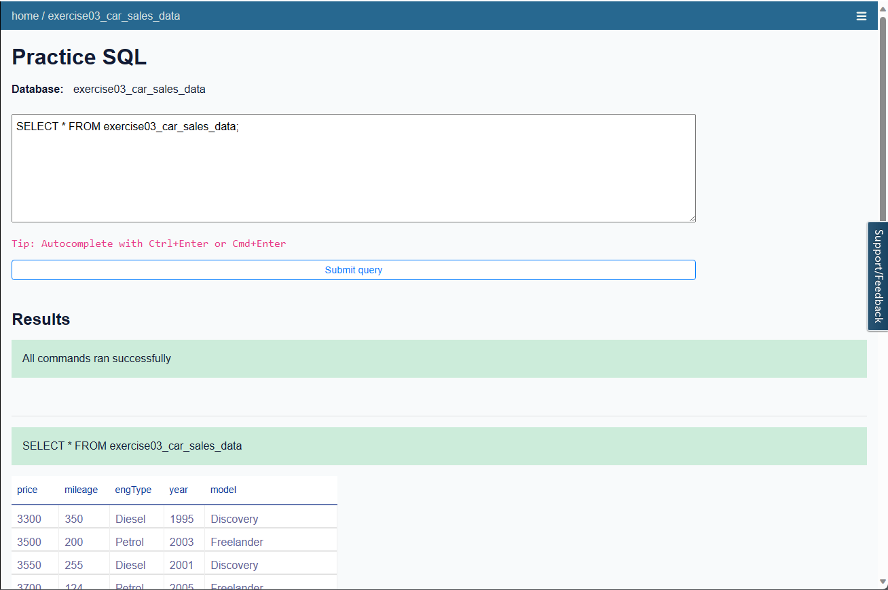

# Hands-On Lab Load data into the Datasette from a CSV file

Now, that you have learned about the process of importing data into a data repository from varied sources, you will load data from a CSV file into the Datasette.

Dataset used in this exercise is [Car Sale Advertisements](https://www.kaggle.com/datasets/antfarol/car-sale-advertisements)

## Steps

- Exercise 1: Create a table by loading a CSV file using Datasette
  


- Exercise 2: Execute basic SQL queries on the data you loaded into your database.

```sql
# it displays the counts.

SELECT COUNT(*) FROM exercise03_car_sales_data;
```


```sql
# to check the maximum price.

select max(price) as max_price from exercise03_car_sales_data
```


```sql
# to display the distinct models

select distinct(model) from exercise03_car_sales_data;
```


# Lab: Load data into the IBM Db2 database from a CSV file

Now that you have learned about the process of importing data into a data repository from varied sources, you will load data from a CSV file into the IBM Db2 database instance you created in the previous lab.

Dataset used in this exercise is [Car Sale Advertisements](https://www.kaggle.com/datasets/antfarol/car-sale-advertisements)


Explore your dataset using SQL queries and Db2.

```sql
select max(price) as max_price from CARSALESTABLE;
```


```sql
select max(price) as max_price from CARSALESTABLE;
```


```sql
select distinct(model) from CARSALESTABLE;
```

