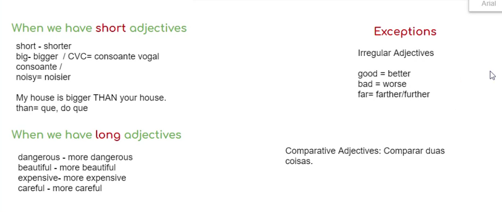

# English 

> The purpose this note is save my annotations of my english classes and my studies annotation extra-classes.🌞
# (4/5/2023)
## how often do you (quanto tempo você faz) 

- how often does he go swimming?
- how often do they cook?

- I drink coffe every day.
- I drink coffe every morning.
- He goes swimming 3 times a week.
- They cook twice a week.
- She cleans the house once a week.

## Present Simple
### -es / -ies / s

#### Termina com o, z, ss, ch, sh, x, mudar por -es.

- to teach - teaches
- to watch - watches
- to kiss - kisses
- to go - goes
  
#### Termina com y e antes vem uma consoante muda para -ies.

- to fly - flies
- to stdy - studies
- to cry - cries
- to dry - dries

#### Qualquer outro coloca um s no final.

to say - says
to eat - eats
to smite - smiles
to work - works
to play - plays
to sleep - sleeps
to clean - cleans

> *Hábitos, rotinas verbos que tem vogal + y: mantém o y e acrescenta o "s"*
> *Verbos que tem consoante + y: tira o y e acrescenta "ies"*

She works at the weekend.
She doesn't at work the weekend.

> *Não muda o verbo para goes no negativo, só no afirmativo.*

{I / We / You / They } don't go to
{He / She / It       } doesn't go to

# (6/11/2023)

## My physical appearance

```text
I'm Black and Young. I have short, black and straight hair. I'm have big lips, big nose and mustache. I'm average length and thin, but i'm a little muscular.
```
## My personal traits 

```text
I am a calm, honest, spontaneous, quiet person. I'm easy going and optimistic.
```

## Mother: Personal Traits

```text
My mother is a responsible, determined, hard working, honest person, but sometimes she is a little moody and angry.
```

## Mother: Physical Appearance

```text
She has medium-length, black and straight hair. She is short and thin, she is 43 years old. She has a mole on his cheek.
```

## Partner

```text
My ideal partner is a caring, calm, delicate, patient, loving, cheerful, dedicated, intelligent person. 
I don't have a specific standard of physical appearance, but when I was younger I imagined a woman to be my partner. A white woman, a woman with black and wavy hair, with big lips, and specifically a ballerina. A woman of average height and well built. 
```

# (6/20/2023)

## Present continuous

> Ações que estão acontecendo no momento os verbos que tem y só recebem o -ing

```text
But i living in the different city than my hometown

He is kicking a ball.
They are waving goodbye.
he's not listening. 
They are walking in the beach.
She's crying.
She's touching the statue.
She's dancing.

I love the tast of chicken with cheese and cream cheese pastel.
```

```text
**Listening**

How many rooms are there in her house?
R-> There are eight rooms in her house.

Where does she read books?
R-> She reads in the Living room.

Is there a gym?
R-> There is a gym.

Is her kitchen big or small?
R-> Her kitchen is small.

What does she do in the garden?
R-> She has barbecue sometimes and she relaxes, she shits in the sun.

Are there dogs in her house?
R-> There aren't in her house, there are two rabbits.

Is there a room of visitors (guest bedroom)?
R-> Yes, there is a room for friends and family.
```

# (6/27/2023)

## There be / There is (Singular) / There are (Plural) | (há-existe)

- There is a cat.
- There isn't a cat
- Is there a cat?

- There are two cats.
- There aren't two cats
- Are there two cats? 

```text
There is a new girl in my class. She is very beautiful. She has long black hair and she is tall. She has a big nose and big eyes. She also has big lips and a nice smile.

My English class is small. There are only six people.

I enjoy going to this bar but there are so many people there on the weekend.

There is a cat outside the house.

I have so many nice friends to invite to my party.
```

these - estes / estas
there - lá
here  - aqui

Mr. - mister
Mrs - misses | senhora casada
miss         | senhorita solteira
miss: /miz/ senhorita não temos se é solteira

mx=pessoas não binárias

# (7/4/2023)

```text
Minas Gerais:

There are historical sites
There are waterfalls
There are mountains
There is cheese bread
There are many trains
```

## Animals

```text
turkey - peru
sheep - ovelha
pig - porco (animal)
	| pork - carne do porco 
cow - vaca
duck - pato
chicken - galinha
rooster | cock - galo
barn - celeiro
horse - cavalo 
neigh - relinchar
cat - gato
dog - cachorro
	| one female dog and one male
hamster - birds
rabbits - coelhos
birds - passarinhos
guinea pigs - porquinho da india
turtles - tartarugas
snake - cobra
lab rats - ratos de laboratório 
fish - peixe
cattle - gado
meat - carne
beef: carne de gado
kinds | types > tipos (especies)
```

# (7/8/2023)

## Wild Animals

- makaw (arara)
- koala 
- python  
- alligator 
- wombat 
- tiger cubs < (filhote de tigre)
- lemurs 
- turtoise 
- giraffes 
- zebras 
- white rhyno 
- meerkats

> *Adjetivo - sempre depois do verbo*
> *Adverbio - vem antes*
> *Somente deixa o verbo no plural em terceira pessoa : she, he, it.*
> *Somente no afirmativo! Negativo e interrogativo NÃO MUDAM.*

A hen doesn't fly. (1 galinha)
Hens don't fly.    (varias galinhas)

Rabbits doesn't lay eggs.
A rabbit don't lay eggs (lay - colocar) 
*Não precisa colocar to no lay por que o doesn't é um auxiliar.*

Does a pig eat meat?

```text
My animal is black.
My animal is a large feline.
My animal has four legs.
My animal is a wild animal.
My animal is a cat.
```

# (7/12/2023)

## Prepositions of place 

```text
between - entre
behind - atras
beside - ao lado
in - dentro, em, na, no
The raccoon is in the garbage can.
near - próximo, perto
under - embaixo
On - sobre | em, na, no (alguma superfície)
The Cat is on the farm. -pq está sobre, como o lugar é aberto usa on.
Above - encima
In front of - na frente de
```
## Demosntrative Adjectives

```text
Near (Perto) 
    - This lion (Singular) | esses, essas, isto 
    - These lions (Plural) | esses, essas

Far (Longe) 
    - That lion | Aquele, Aquela, Aquilo
    - Those lions | Aqueles, Aquelas
```

```text
This zebra is next to the car
Those lions are together.
These animals like sleeping.
That fish likes swimming.
Are those giraffes under the tree?
Do you see that big elephant?
```

> *listening to | verbos que não tem conjugação usa "to".*
> *present continuos | listening*
> *present simples | listen*
> 
> She doesn't have any sister?
>   - have não muda em frase negativa, nem interrogativa, somente afirmativa.
>   - She has one sister.

# (7/26/2023)

## Weather & Seasons

Winter
Summer
Spring
Autumn

No verão: In the summer.
em janeiro: In January.

> Meses do ano com letra maiuscula.

```text
My books there are on table.

Where is your phone? It's in the backpack.

Those zebras are slepping under the tree.

The elephants are drinking water in the river. 

She doesn't like to go the farm because is very far.

There are many pigs in the farm.

What do the cows eat? They eating leaves.

My favorite season is spring, because isn't very hot and isn't very cool, the weather starts warm up.

I go to pool with my family. I like walk with my girlfriend in new places, because usually the weather is very good.

I like to wear shirt, short, sneakers and cap.

It's cloudy and sunny. But with very windy, so this let weather a little cold.

Is very cold, because in my city there are many montains arround, it difficult the change of the weather.

I enjoy walk with my dogs.

I enjoy stay in my house, cooking, watching movies or series with my girlfriend 

No, I feel relax, because if i listen stormy i am alive.
```
# (8/8/2023)

## Family

```text
to / with = com
to / in / for = para

to talk  to   my friends | falar com meus amigos
------- ----
 falar  falar


grandmother: avó
grandfather: avô 
mom: mãe
dad: pai
parents: pais
brother: irmão
sister: irmã
siblings: irmãos
aunt: tia
uncle: tio

my    = meu(s) , minha(s)
your  = seu, sua
his   = dele
her   = dela
its   = dele, dela
your  = seus, suas
our   = nossos, nossas
their = deles, delas

**Is your family big or small?** Small family, mother's side is small
**What are your parents’ names?** Ana paul
**Do you have siblings? How many?** She doesn't have siblings 
**How many cousins do you have?** 11.
**Who are you closest to in your family?** I'm closest to my mother.
                                               ----------
                                               próximo de 
aunt / ént / 

close family - familia que mora com a gente
extended family - parents mais próximos

mother-in-law | sogra
```
# (9/12/2023)


## Can / Can't / Could

```text
Can you ___? | Você pode ___?
Can I ___? 

can't | cannot
can

**Request and Permission**

Can: More Informal  
Could: More Formal 

Could - Passado do Can | Podia, Poderia.
(Não pronuncia o l)

```

# 9/19/2023

## Can | Could

> Can | Could : Modal Verbs, nunca usamos o to depois do proximo verbo que vim.

```text

I need to go to the bathroom
Can I go to the bathroom?

I want to open the window
Can I open the window?

I need you to lend me a pencil
Can you lend me a pencil?

I want to have a soda.
Can I have a soda?

I need to go now.
Can I go now?

I want you to help me.
Can you help me?

```

**annotation**

```text

Get well soon! | "Fique bem logo", "Melhoras"

to record : gravar /ri CÓRD/
record: recorde /RÉ cord/

order a pizza : pedir uma pizza

I can't go in the beach, because is very far so my grandparents couldn't travel for a long time.

take them = levá-los
with music from the years

choose : escolher
already : já

like - a ball like a orange _______ | uma bola tipo uma laranja
kind - what kind of music do you __ | que tipo de música 

to wish : Desejar

```

# 9/26/2023

## Giving advice

**class annotations**

```text
to give advice to: Dar conselhos para
to take advice to: Receber conselhos para

{advice sempre vem acompanhando por to, não usamos o for}

to advise: aconselhar

to travel: viajar
trip: viagem

at least : ao menos, pelo menos

nutrition : alimentação
meals : refeição

drink alcohol : beber alcool

Modais Verbs
Can : Poder
Should : Deveria
Could : Poderia

You should dance like terry crews with weights in your hands.

a good night's sleep : uma boa noite de sono.
```

# 10/3/2023

## Making Comparisons

**class annotations**

```text

I'd like= I would like = Eu gostaria
I was very afraid/ scared = Eu estava com muito medo.
I enrolled = Eu me inscrevi

clothes {pronuncia: clouz}
ugly: feio
skirt: saia

Nós colocamos adjetivo antes da palavra onde estamos descrevendo ou depois do verbo to be.
exemplos:
    - the *new* coat is **blue**
    = the *red* skirt is **beautiful**
trainers (ingles britânico): tenis 
sneakers (ingles americano): tenis

Comparative Adjectives: 
    Compare 2 nouns.



The shoes are huglier than sneakers
The snaekers are more versatility than shoes
The shoes are more formal than sneakers 
```
# 10/10/2023

**class annotations**

##

```text

Comparative: Compare two elements.

In what sense : Em que sentido?

{
    1: I don't know what to wear to this party today. Should I wear the **white or the red shirt.**

    2: The white one looks **older** than the red one.

    1: You are right, but the white one is more comfortable **than** red one.

    2: You should wear your new **blue** sneakers. They are beautiful.

    1: It's a formal party. I should wear shoes, beacause they are **more formal** than sneakers.

    2: Which **pants** do you prefer? the blue **one** or the black **one**?

    1: The black one is **newer** than the blue one.

    2: Great. Now you are dressed to kill.9
}

one: substitui uma coisa que já foi falado antes, como sabemos que estamos falando da "shirt" colocamos o "one" depois pra não precisar repetir. 
[Substitui um substantivo mencionado na frase para não repetir.]

Have a good one. Expressão usada para se referir ao assunto da conversa. Exemplo:
{
    1: My weekend...!
    2: Have a good one!
}
```

# 10/17/2023

**class annotations**

```text
Superlative: Compare to the whole group. > Whole group | grupo inteiro | o grupo todo

Short adjectives receive -est:
    - big   = the biggest
    - small = the smallest
    - dirty = the dirtiest
    - cheap = the cheapest
Long adjectives receive "the most"
    - beautiful = the most beautiful
    - expensive = the most expensive

Irregular Adjetivos

Adjetivo:    good     |  bad     
Comparative: better   |  worse
Superlative: the best |  the worst

Roupas de marca | Designer Clothes

```

# 11/7/2023

```text
CEO : chief executive officer
CFO : chief finantial officer

to get retired : se aposentar

others : só sera usado sozinho

House chores[especifica para casa]: Tarefas domésticas

Does it work? : Isso funciona?

and that's it : e é isso. 

I choose Tag Heuer Watch, because it's cost benefit relationship than other watches.
It is chepest than Ferrari Watch and has a better customers' opinion than Ferrari.

for you to eat in the travel / on the way?
for you to do / for you to eat?
```
#### Intensifier + Adjective / Characteristic

```text
# INTENSIFIER + ADJECTIVE/ CHARACTERISTIC 

VERY= MUITO REALLY= REALMENTE 
EXTREMELY= EXTREMAMENTE 
GREAT= GRANDE, MUITO, BASTANTE 
SUPER=SUPER | THIS IS SUPER NICE. 
SO=TÃO | THIS IS SO NICE.
A LITTLE=PEQUENO, POUCO.

# Downtoners

not that = não tão | it's not that important 
Not ... at all: de jeito nenhum, de forma alguma 
    | I don't have to bring my keys at all.
    | It's not important to bring your keys at all.
```
# 11/14/2023

```text
Describe it: Remembering THERE BE verb

There is a headset and there is a pair of shoes.
There aren't clothes.
There is a bottle in the bag.
There is one camera.
There are socks
There are pants

luggage : mala

There aren't shirts in the luggage.
There is a cap.

few : algumas, alguns -> (few) Sensação de pouco, quantidade, não ser suficiente 
    To put a few things inside your bag [to pack light] : fazer as malas com poucas coisas.
    Já joguei algumas mas queria jogar mais (Sensação de não suficiente)
some : algumas, alguns -> já joguei algumas partidas não vou jogar mais (Sensação de muito)
```
## Role Play 
```text
Debora: Let's go to Disney, we can do everything over there!

Igor: Yes, we can go, I agree, and you Gabriela?

Gabriela: Me too, what can we to bring?

Debora: Is extremely important to bring passport, personal documents, summer clothes and your toiletries.

Igor: Let's try to pack light, because our car is very old, what do you think Gabriela?

Gabriela: Yes, it's very necessary. but we can't forget about money 💵, and to travel on a budget, please.

Igor: Yes, we are poor 😢

Gabriela: I think that don't need to take many personal hygiene products. The hotels provide very things.
```

# 11/21/2023

```text
It's very necessary to bring some jackets.
It's not important to bring some beach clothes (todas as roupas)/bathing suit(roupas para entrar na piscina) at all.
It's not that important to bring shorts. 
```

### Making a decision

to choose, choosing | Escolher.
what about shoes? | E quanto aos calçados?


to choose= escolher
Are you an indecisive person

```text
there is to eat. / whatever I have at home. / whatever there is at home.  / all there is. / picky eater 
I'm not a picky eater. :: Eu como tudo que tiver, eu como de tudo.

iNdecisive
It's 
one pair of pants
some pants 
sneakers= tenis
```
### Comparative adjectives

```text
to do:
    latpot - good features
        | Apple laptops HAVE more good features with iphones than samsung phones.
    
```
# 11/21/2023

**class annotations**

```text
about it : sobre isso
to spend : gastar
to celebrate : celebrar
to pray : rezar
to get on our kness : se ajoelhar
then: e então, então, e aí...
then: no passado, lá atrás
New year's Eve : Véspera de Ano Novo

sempre que tiver um "of" e depois um verbo, terá ing no final
example: 
    we don't have the costume of celebrating
 
making a toast : fazendo um brinde

Let's make a toast | Vamos fazer um drink
    Cheers              Saúde

witch | bruxa
mummy | mumia
```
### Simple Past 

#### Be
```text

is- was 
are- were 
am- was 

was/were = era, estava
were= /uãrr/ 

I was tired. 
I wasn't / was not/ tired.
Was I tired?

They were happy. 
They weren't happy. 
Were they happy?
```
**Activities | Unscramble**

```text
1. How was your Christmas?
2. It was a very nice dinner.
3. My family wasn't all united.
4. My cousins from Rio weren't there.
5. There was a lot of food.
6. We were so full. 

full = cheio
    we were so full = Nós estamos tão cheios 
    I'm full of this = Estou cansado disso.
    I'm full of this shit = Estou muito cansado disso.
```

````
# Dictionary

- **approach:** abordagem
- **learning:** aprendizagem
- **"and so on":**  e assim por adiante
- **"Rather than":** em vez de 
- **"from scratch":** do zero | desde o ínicio
- **"over the years":** ao longo dos anos
- **among:** entre
- **lack:** falta | ausência
- **availabe:** disponível
- **struggled:** ter dificuldades
- **"so that":** de modo que 
- **even:** mesmo
- **However:** No entanto
- **most:** mais | maioria | a maior parte
- **"to set up":** para criar
- **which:** o que | o qual | que | qual
- **within:** dentro de 
- **It's worth nothing:** É de notar que
- **comes:** vem
- **built-in:** embutido
- **doesn’t matter:** não importa
- **at this point:** neste momento
- **complaining:** reclamando
- **Since:** Como 
- **keep:** Manter
- **might:** pode
- **Even though:** Mesmo assim
- **rely:** confiar
- **least | at least three:** minimo | pelo menos três
- **ensure:** assegurar | garantir
- **whenever:** sempre que  
- **hundreds:** centenas
- **thousands:** milhares
- **somewhat:** um pouco | de certa forma
- **seemingly:** parece que | aparentemente
- **we’ll:** vamos
- **currency:** moeda do pais
- **quite:** um pouco
- **smell:** cheirar | cheiro | Nose
- **smelly:** fedorento
- **wave:** acenar | abanar
- **whole:** tudo | inteiro
- **lift** elevador / elevator (americano)
- **much:** muito de intensidade
- **many:** muito de quantidade  
- **It depends:** Isto depende
- **I agree with her/him:** eu concordo com ela e ele
- **let me (show, see):** deixe me (mostrar, ver)
- **leave:** partir / ir embora
- **They are stuck there:** estar preso em algum lugar
- **My mouth likes this:** Minha boca gosta disso
- **Great taste:** Gosto bom
- **Hmm, this tastes good:** hmm, isso tem um gosto bom
- **You have a great taste for music:** Você tem um bom gosto musical
- **to baking:** assar
- **to take care of:** cuidar de
- **take care:** se cuida
- **to feed:** alimentar
- **bitch:** cadela
- **we are on the same boat:**estamos no mesmo barco.
- **mate: companheiro:** amigo
- **as if you were:** (como se você estivesse "imaginação") 
- **have you met:** (você encontrou/conheceu?)
- **let me think:** Me deixe pensar
- **shelf:** estante
- **I will do:** Eu vou fazer
- **Share it with us:** Compartilha isso com a gente
- **Sorry for interrupt:** Desculpa interromper
- **Same old:** as mesmas coisas de sempre
- **Same things:** As mesma coisas
- **Doente:** sick
- **taking examinations:** fazendo exames
- **to take:** tomar, levar, pegar
- **A litte boy is taking medication:** tomando remédio.
- **remedy:** remédio caseiro
- **medication:** medicação de farmácia
- **bolsa de água quente:** heating pad 
- **put:** colocar
- **I have a fever:** Eu estou com febre
- **Food poisoning:** Intoxicação Alimentar
- **I have the flu:** Estou Gripado
- **I have a cold:** Eu estou resfriada
- **My legs hurt:** minas pernas doem
- **hurt:** doem
- **heart:** coração
- **I have pain in my legs:** Eu tenho dor nas pernas
- **pain:** dor
- **Sore:** dolorido
- **headache:** dor de cabeça
- **stomachache:** dor de estomago
- **sore:** dolorido
- **I have a sore throat:** Estou com dor de garganta
- **a driver's license.:** Carteira de Motorista
- **my bad:** foi mal
- **noodles with sausage:** macarrão com salsicha
- **Nobody:** Ninguém
- **Improve:** Melhorar
- **Any other ideas?:** Alguma outra ideia?
- **I'm not picky eater:** Não sou exigente com a alimentação.
- **blow:** assoprar
- **junk food:** comida de má qualidade.
- **"lying in bed":** Deitar na cama
- **"to lay down":** Deitar-se
- **still:** ainda 
- **"Don’t worry"**: Não se preocupe
- **straightforward**: Simples 
- **"As we touched upon"**: Conforme mencionamos | Como já abordámos
- **been**: ter sido | foram | foi
- **"day to day"**: dia a dia
- **among**: entre 
- **such**: tal | tais | como | for such systems 
- **made**: feito | realizado
- **to deal**: para lidar 
