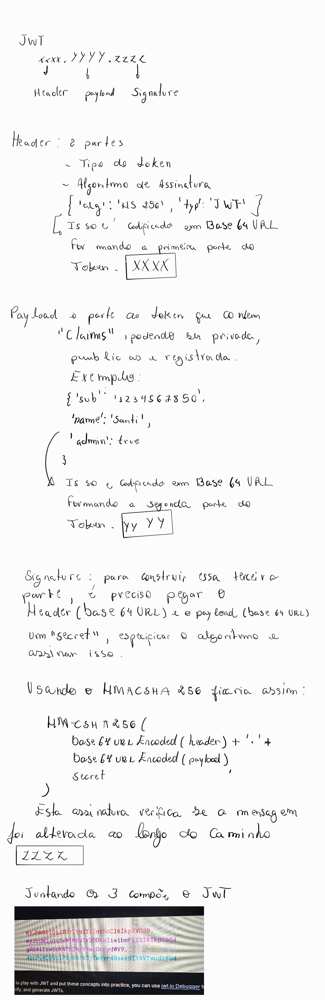

# JWT

[research source](https://jwt.io/introduction)

RS256, RS384, RS512, ES256, ES384, etc. Esses algoritmos usam chave pública/privada, o que é mais seguro para autenticações distribuídas (ex: tokens emitidos por um sistema e verificados por outro).

Como o sistema irá fazer uso de provedor externo foi ideal optar por algoritmo como RS256

Por quê?    

Provedores como  Google, AWS Cognito, Auth0, Okta, assinam os tokens JWT usando RS256, ou seja, Eles usam uma chave privada para assinar. Então usamos a chave pública deles para verificar. Isso permite que valide os tokens sem precisar da chave secreta do provedor.